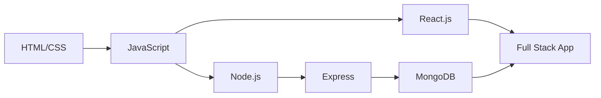

# 🚀 SIPP 2025 - Full Stack Practice Hub

Welcome to the **Summer Internship & Placement Program 2025** repository for Full Stack Development!  
This collection houses all practice questions from our classroom sessions, organized sequentially to build your skills from fundamentals to advanced concepts.

 

## 🎓 Program Overview

**SIPP 2025** prepares college students for industry-ready software development skills through guided practice and mentorship. This repository captures our learning journey with:

- ✨ In-class exercises
- 🛠️ Faculty-guided projects
- 💡 Mentor-assigned challenges
- 🏗️ Progressive skill-building tasks

## 📂 Content Structure

```
SIIP-2025-FullStack/
│
├── 01_HTML-CSS-Basics/              # Week 1 content
│   └── Q1_Build-a-Portfolio.html
│
├── 02_JavaScript-Fundamentals/      # Week 2 content
│   └── Q2_FormValidation.js
│
├── 03_React-Basics/                 # Week 3 content
│   └── Q3_TodoApp.jsx
│
├── 04_Node-Express/                 # Week 4 content
│   └── Q4_API-Creation.js
│
├── 05_MongoDB-Database/             # Week 5 content
│   └── Q5_UserSchema.js
│
├── 06_Fullstack-Projects/           # Capstone projects
│   └── Q6_LoginSystem/
│
└── README.md
```

## 📝 Classroom Exercises Log

| Session | Topic | Assignment | Instructor | Status |
|:-------:|:------|:-----------|:----------:|:------:|
| 01 | HTML + CSS | Portfolio Website | mr. Govind Jha  | ✅ |
| 02 | JavaScript | Form Validation | mr. Govind Jha | ✅ |
| 03 | React.js | Todo Application | mr. Govind Jha  | ✅ |
| 04 | Node.js + Express | REST API Design | mr. Govind Jha  | ✅ |
| 05 | MongoDB | Database Schema | mr. Govind Jha | ✅ |
| 06 | Full Stack Integration | Auth System | Industry Mentor By Mr. Govind Jha  | ✅ |

> 💡 Table updates after each class session!

## 🧠 Learning Path



## 💻 Tech Stack

<div style="display: flex; gap: 10px;">
  
  
  
  
  
  
  
</div>

## 👨‍💻 Student Maintainer

**Vipin Yadav**  
Computer Science | Batch of 2026 | SIPP Participant

## 📱 Connect With Me

[](mailto:vipinyadav9m@gmail.com)
[](https://linkedin.com/in/vipinyadav01)

---

<div align="center">
  <p>⭐ Star this repo if it helps your learning journey! ⭐</p>
  <p>SIPP 2025 - Developing industry-ready professionals</p>
</div>
